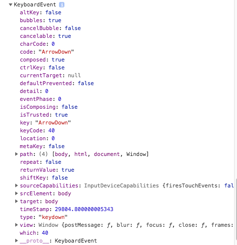

Html Capture Key Event Demo
===========================

在浏览器中捕获用户按键。

注意：对于方向键，必须监听`keydown`才能捕获（使用`keypress`只能捕获普通按键）。

在浏览器中打开`index.html`，同时打开`developer tool` -> `console`。然后回到页面上，按下任意键的同时，观察console中的输出。

输出形如：

以下属性值得留意：

- `code`
- `charCode`
- `key`
- `keyCode`
